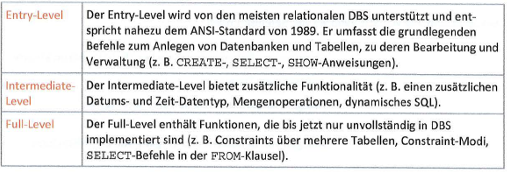
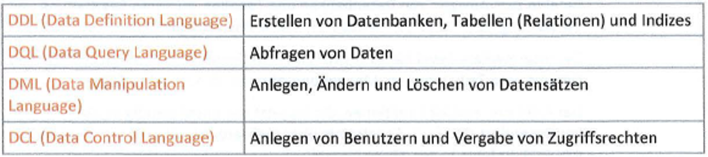
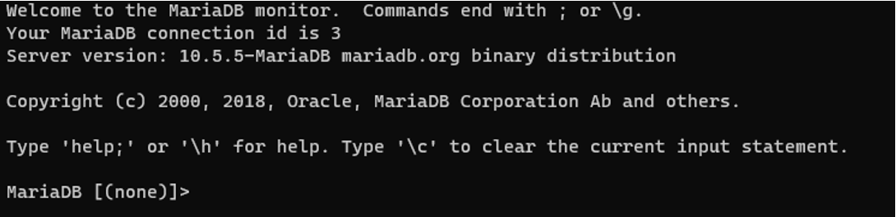

# 6 Datenbanken

## 6.1 Die Datenbankabfragesprache SQL

Die Datenbankabfragesprache SQL wurde aus der Abfragesprache SEQUEL (Structured English Query Language) der Firma IBM entwickelt. Mit der Entwicklung der Sprache wurde das Ziel verfolgt, auch für Nicht-Programmierer eine relativ einfache Sprache zur Abfrage von Datenbanken zur Verfügung zu stellen, die keine mathematische Notationen (z.B. die Quantoren V und 3) verwendet.

SQL entwickelte sich zum internationalen Standard und wurde 1986 vom ANSI (American National Standards Insitute) als Standard SQL (SQL-86) festgelegt. Im Laufe der Jahre wurde die Sprache intensiv weiterentwickelt und ANSI verföffentlichte weitere Standards, die analog zu dem betreffenden Jahr mit SQL-89, SQL-92, SQL:1999, SQL:2003, SQL:2006, SQL:2008, SQL:2011 und SQL:2016 bezeichnet wurden. Für SQL-92 wird allgemein auch die Bezeichnung SQL2 und für SQL:1999 die Bezeichnung SQL3 verwendet. Die neueste Version SQL:2016 wurde im Dezember des Jahres 2016 veröffentlicht. Der Standard wurde im Vergleich zur Vorversion neben einer Reihe optionaler Ergänzungen um zwei Funktionen erweitert:

- Die Unterstützung von JSON. Die Javascript Object Notation (JSON) dient als kompaktes Datenformat dem Datenaustausch zwischen Anwendungen und ist besonders im Bereich der Web- und mobilen Anwendungen weit verbreitet. Das Format besitzt eine einfache lesbare Textform, ist unabhängig von Programmiersprachen und wird in allen wichtigen Programmiersprachen durch sogenannte Parser zur Analyse der Daten unterstützt.
- Die Unterstützung des sogenannten *row pattern matching*. Diese Funktion dient der Analyse von Tabellenzeilen zur Erkennung von Ähnlichkeiten und Trends unter Verwendung regulärer Ausdrücke, befindet sich jedoch noch im Anfangsstadium. So werden nicht alle regulären Ausdrücke unterstützt und auch die praktische Anwendung ist zum Zeitpunkt der Erstellung dieses Buches nur eingeschränkt möglich, lediglich das DBMS Oracle unterstützt einige Möglichkeiten.

Die Spezifikation umfasst sowohl die Syntax und Semantik der Datenbankabfrage- und Datenmanipulationssprache SQL als auch Konzepte des DBS (Transaktionen, Zugriffsschutz, Sicherung der Integrität, Implementierung objektorientierter Funktionalität etc.).

Bei all den Weiterentwicklungen der Sprache basieren aktuelle Datenbanken in der Regel immer noch auf dem SQL2-Standard. Die Modifikationen der nachfolgenden Standards werden dabei in unterschiedlichem Mass in die Datenbanken implementiert. Der Sprachumfang von SQL2 wird durch die drei Conformance Level untergliedert:



Die Hersteller von DBMS implementieren meist die gesamte Funktionalität des SQL2-Entry-Levels und Teile der anderen Level. Häufig werden aber auch eigene Erweiterungen eingebaut, was die Portierung erschwert. Anpassungen lassen sich aber relativ leicht durchführen. Ab SQL:1999 wird die Sprache nicht mehr in die drei Level eingeteilt. Ein Kernsystem Core-SQL enthält einen grossen Teil des Funktionsumfangs der Sprache (entsprechend dem Full-Level). Zusätzlich werden Erweiterungen angeboten. Von diesen ursprünglich 14 Stück sind noch 9 relevant:

- Teil 1: SQL/Framework 
- Teil 2: SQL/Foundation
- Teil 3: SQL/CLI (Call-Level Interface)
- Teil 4: SQL/PSM (Persistent Stored Modules)
- Teil 9: SQL/MED (Management of External Data)
- Teil 10: SQL/OLB (Object Language Bindings)
- Teil 11: SQL/Schemata (Information and Definition Schemas)
- Teil 13: SQL/JRT (SQL Routinesand Types Using the Java TM Programming Language)
- Teil 14: SQL/XML (XML-Related Specifications)

In diesen Bereich gehört auch die Erweiterung zu JSON. Zusätzlich gibt es noch weitere SQLPakete für Multimedia und Anwendungen. Für die Version SQL:2008 entschied die Standardisierungskommission, dass vier der neun Teile - SQL/CLI, SQL/MED, SQL/OLB und SQL/JRT- stabil sind und keine weitere Überarbeitung benötigen. Somit betreffen die späteren Neuerungen nur die Teile SQL/Framework, SQL/Foundation, SQL/PSM, SQL/Schemata und SQL/XML.

Zwecks Einsicht können auf der Webseite [http://www.iso.org](http://www.iso.org) die Definitionen der einzelnen Teile des Standards erworben werden. Zu erreichen ist Liste der Dokumente über die Suche nach '9075',

SQL ist eine interaktive Sprache und erlaubt [Ad-hoc-Abfragen](http://userpage.fu-berlin.de/~ram/pub/pub_jf47ht81Ht/datenbanken_sql) von Datenbanken (Abfragen, die sofort ausgeführt werden). Über sogenannte SQL-Skripts können Sie mehrere SQL-Anweisungen automatisiert ausführen lassen. Ausser zur interaktiven Eingabe wird SQL auch in Anwendungen zur Kommunikation mit einer Datenbank eingesetzt. Dabei können lesende wie auch schreibende Zugriffe durchgeführt werden.

Zum Sprachumfang von SQL gehören vier Befehlsgruppen:



## 6.2 Datenbank erstellen

Beim Aufbau einer Datenbank gehen Sie prinzipiell wie folgt vor:

- Legen Sie zuerst die Datenbank an.
Sie dient als Container für die Tabellen und alle weiteren Datenbankobjekte.
- Erstellen Sie danach die benötigten Tabellen.
Dabei legen Sie zunächst nur die Struktur der Tabellen fest, d. h., welche Spalten sie enthalten sollen und welche Datentypen darin gespeichert werden und legen den Primärschlüssel für die Tabelle fest.
- Füllen Sie jetzt die Tabellen mit den Daten.
Tabellen sind die einzigen Datenbankobjekte, in denen die Daten physisch gespeichert werden. Nun können Sie Auswertungen der Daten vornehmen oder weitere Aktionen ausführen, z. B. Daten ändern oder löschen.

Der erste Schritt beim Erstellen einer Datenbank ist das Anlegen der Datenbank selbst. In ihr werden später die Daten in Form von mehreren Tabellen gespeichert. Sie können unbegrenzt viele Datenbanken erstellen und so die zu speichernden Daten nach Themengebieten zusammenfassen. Falls unterschiedliche Benutzer mit dem Datenbanksystem arbeiten, sollten Sie auf die korrekte Vergabe von Zugriffsrechten für die einzelnen Benutzer achten.

Über die Anweisung CREATE DATABASE erstellen Sie eine neue Datenbank. Diese Datenbank enthält noch keine eigenen Tabellen. Oft sind jedoch bereits einige Systemtabellen enthalten, die z.B. Informationen über die Datenbank und die Datenbankobjekte enthalten, sogenannte Metadaten.

Um eine Datenbank erstellen zu können, benötigen Sie das Ausführungsrecht für die CREATEDATABASE- Anweisung. Der Administrator vergibt dieses Recht mit der Anweisung GRANT CREATE DATABASE. Der Benutzer, der die Datenbank erstellt, wird danach zu ihrem Eigentümer.



Über die Anweisung CREATE DATABASE erstellen Sie eine neue Datenbank. Diese Datenbank enthält noch keine eigenen Tabellen. Oft sind jedoch bereits einige Systemtabellen enthalten, die z.B. Informationen über die Datenbank und die Datenbankobjekte enthalten, sogenannte Metadaten.

Um eine Datenbank erstellen zu können, benötigen Sie das Ausführungsrecht für die CREATEDATABASE- Anweisung. Der Administrator vergibt dieses Recht mit der Anweisung GRANT CREATE DATABASE. Der Benutzer, der die Datenbank erstellt, wird danach zu ihrem Eigentümer.

### Datenbank in MariaDB erstellen

In Maria DB können Sie eine neue Datenbank entweder über den Datenbank-Client *mariaDB monitor* erstellen, der zum Lieferumfang von Maria DB für die verschiedenen Betriebssysteme gehört, oder Sie verwenden eines der Hilfsprogramme mit grafischer Oberfläche, die es für MariaDB gibt.

Aufgrund ihrer Herkunft als Ableger von MySQL verwendet Maria DB an vielen Stellen Komponenten von MySQL, so dass sich dieser Name in der Bezeichnung von Zusatzprogrammen und Befehlen wiederfindet.

Über die folgenden Anweisungen erstellen Sie eine neue Datenbank in Maria DB und wählen diese aus.

**Syntax:**

```sql
CREATE DATABASE IF NOT EXISTS demo;
USE demo;
```

Mit der ersten Anweisung wird eine neue Datenbank mit dem Namen *demo* erstellt, falls diese noch nicht existiert.

Die neue Datenbank wird ausgewählt (zweite Anweisung), damit sie bearbeitet werden kann. Es kann immer nur eine Datenbank ausgewählt sein.

Das Erstellen einer Datenbank in MariaDB bedeutet das Erzeugen eines neuen Verzeichnisses im Dateisystem mit dem entsprechenden Datenbanknamen. Je nach verwendetem Betriebssystem wird daher zwischen Gross- und Kleinschreibung unterschieden, z.B. unter Linux. Die Datenbankverzeichnisse befinden sich im Verzeichnis ``..\data` des MariaDB-Installationsverzeichnisses oder des MariaDB-Benutzerverzeichnisses (unter Windows beispielsweise `C:\Program Files\MariaDB 10.5\data`)

**Syntax:**

```sql
CREATE DATABASE [IF NOT EXISTS] datenbankname;
```

- Mit der SQL-Anweisung `CREATE` werden neue Datenobjekte erzeugt. Danach erfolgt die Angabe, welches Objekt erzeugt werden soll, in diesem Fall eine neue Datenbank (DATABASE). Zum Abschluss müssen Sie den gewünschten Namen der Datenbank angeben.
- Falls die Datenbank bereits existiert, wird eine Fehlermeldung ausgegeben, Um dies zu umgehen, kann die Anweisung IF NOT EXISTS hinzugefügt werden. In diesem Fall wird die Datenbank nur dann erstellt, falls sie noch nicht existiert.

Für die Vergabe des Datenbanknamens unter MariaDB gelten die folgenden Regeln:

- Der Name darf maximal 64 Zeichen umfassen.
- Es sind alle Zeichen erlaubt, die in einem Verzeichnisnamen des betreffenden Betriebssystems verwendet werden dürfen. Nicht erlaubt ist grundsätzlich das Zeichen `/`.

## 6.3 Datenbank anzeigen und auswählen

Wenn Sie den Namen einer bestimmten Datenbank nicht kennen können Sie sich eine Liste der vorhandenen Datenbanken anzeigen lassen.

In MariaDB zeigen Sie mit der Anweisung `SHOW DATABASES` alle bestehenden Datenbanken an.

```sql
SHOW DATABASES;
```

### Datenbank auswählen in MariaDB

Bevor Sie mit einer bestimmten Datenbank und den darin befindlichen Datenbankobjekten arbeiten können, müssen Sie diese auswählen.

In MariaDB erfolgt die Angabe eines berechtigten Benutzers bereits beim Aufruf des Datenbank-Clients, eine bestimmte Datenbank ist dann jedoch noch nicht aktiviert. Um die zu bearbeitende Datenbank auszuwählen, verwenden Sie die Anweisung `USE`. Danach folgt die Angabe des Datenbanknamens.

**Syntax:**

```sql
USE demo;
```

Die Datenbank *demo* wird ausgewählt.

### Syntax der Anweisung USE in MariaDB

```sql
USE datenbankname;
```

- Die Anweisung `USE` wählt die angegebene Datenbank aus. Alle weiteren Anweisungen beziehen sich auf diese Datenbank.

## 6.4 Datenbank löschen

Über die Anweisung `DROP DATABASE` wird eine Datenbank mit allen enthaltenen Daten gelöscht. Dabei wird keine Warnmeldung ausgegeben, der Vorgang kann nicht rückgängig gemacht werden. Mit diesem Befehl werden die Katalogeinträge der Datenbank sowie das Verzeichnis inklusive der Daten gelöscht.

## Syntax in MariaDB

```sql
DROP DATABASE [IF EXISTS] datenbankname;
```

- Der Name der Datenbank folgt am Ende der Anweisung.
- Die Anweisung `IF EXISTS` verhindert das Auftreten von Fehlermeldungen, falls die Datenbank nicht existiert.

## [6.5 Übungen](../src/Exercises/Kapitel_06/MariaDB/Exercise_6_5.sql)

Erstellen Sie eine Datenbank mit dem Namen *Uebungen*. Verwenden Sie dazu den entsprechenden Datenbank-Client.

```sql
CREATE DATABASE IF NOT EXISTS Uebungen;
```

Erstellen Sie eine Datenbank mit dem Namen *testdb*.

```sql
CREATE DATABASE IF NOT EXISTS testdb;
```

Wechseln Sie zur Datenbank *testdb*.

```sql
USE testdb;
```

Löschen Sie die Datenbank *testdb*.

```sql
DROP DATABASE IF EXISTS testdb;
```
